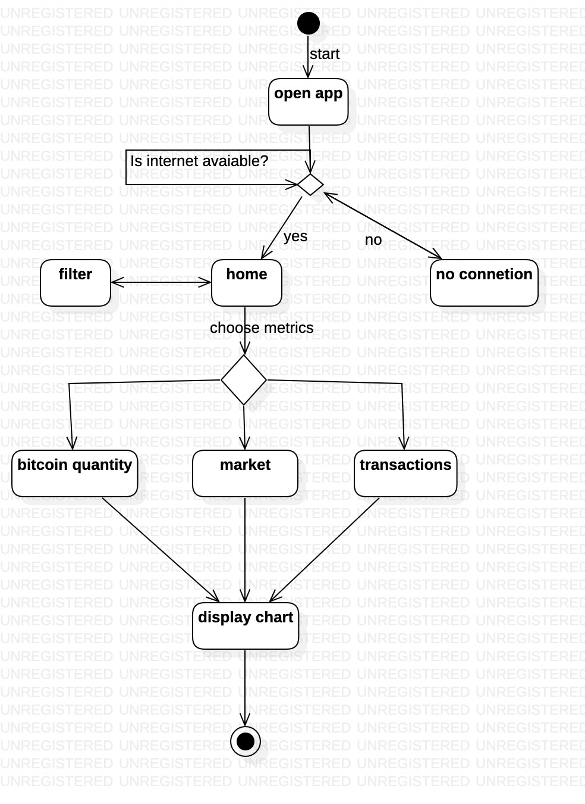

# Bitcoin Metrics

**BitcoinMetrics** is a sample app Android application 📱 built to demonstrate use of Modern Android development tools️. 

## About

BitcoinMetrics is an Android app that display bitcoin metrics data in Bar chart

The application features :
 * network state management that verify if the connection is available
 * plot of bar char with thirty last days of data
 * add filters to improve data retrieval
 * display three different metrics-> Total Bitcoins, Market Value, Transactions.




## Built With 
- [Kotlin](https://kotlinlang.org/) - First class and official programming language for Android development.
- [Coroutines](https://kotlinlang.org/docs/reference/coroutines-overview.html) - For asynchronous and more..
- [Android Architecture Components](https://developer.android.com/topic/libraries/architecture) - Collection of libraries that help you design robust, testable, and maintainable apps.
  - [LiveData](https://developer.android.com/topic/libraries/architecture/livedata) - Data objects that notify views when the underlying database changes.
  - [ViewModel](https://developer.android.com/topic/libraries/architecture/viewmodel) - Stores UI-related data that isn't destroyed on UI changes. 
  - [ViewBinding](https://developer.android.com/topic/libraries/view-binding) - Generates a binding class for each XML layout file present in that module and allows you to more easily write code that interacts with views.
  - [Navigation](https://developer.android.com/guide/navigation) - Allow users to navigate across, into, and back out from the different pieces of content within your app
- [Hilt](https://dagger.dev/hilt) - Dependency Injection Framework
- [Retrofit](https://square.github.io/retrofit/) - A type-safe HTTP client for Android and Java.
- [Moshi](https://github.com/square/moshi) - A modern JSON library for Kotlin and Java.
- [Moshi Converter](https://github.com/square/retrofit/tree/master/retrofit-converters/moshi) - A Converter which uses Moshi for serialization to and from JSON.
- [Glide](https://bumptech.github.io/glide/) - An image loading library for Android.
- [MocKK](https://mockk.io/) - A kotlin library for Android unit test.
- [Espresso](https://developer.android.com/training/testing/espresso) - Espresso to write concise, beautiful, and reliable Android UI tests.

## Architecture Project Structure
```
|---app                                 # This module is responsible for initilizate the application
    |---di.features                     # This package is responsible to provide dagger components of all features
       
|---common                              # This module is shared between all other apps module
    |---model                           # it contains all data modeling for api and bussiness rules

|---core                                # Modules shared between all other app modules
    |---di                              # This contains all components that could be injected in features
    |---ui                              # This contains all android components, view extensins, styles that could be used in features

|---feature                             # Each module here is decoupled for each other enabling better parallel development
    |---bitcoin                         # Contains the fragments to display metrics 
    |---filters                         # Contains activity to set different filters to metrics
```


## Architecture
This app uses [***MVVM and Clean Architecture***](https://developer.android.com/jetpack/docs/guide#recommended-app-arch) architecture.

The reason behind this decision is to create a concise and well decoupled project, because:

* Each layer may contain one or more module, but all of them must be logical related
* The use of UseCases induces the behavior of single responsibility, because each use case may contain only one public method.
* This architecture also escalates well with the multi module project because each team could work on separated features.


## Feature demo


